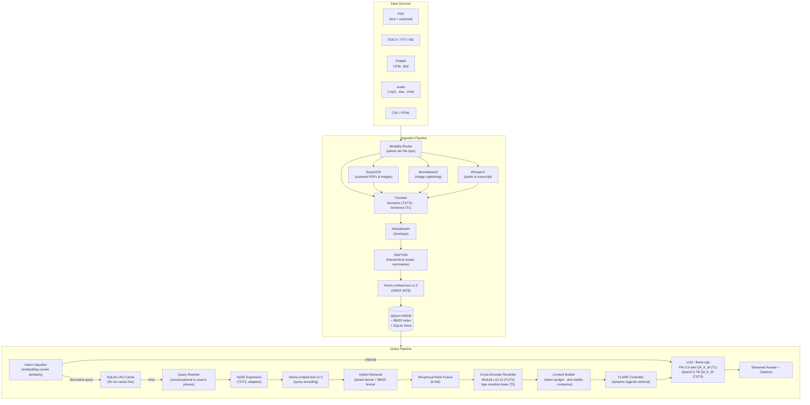

<p align="center">
  <picture>
    <source media="(prefers-color-scheme: dark)" srcset="https://raw.githubusercontent.com/AdityaWagh19/Motif/main/logo.png" style="filter: invert(1) brightness(2);">
    
  </picture>
</p>

# Motif

**Motif** is an offline, multimodal Retrieval-Augmented Generation (RAG) system for querying your local documents. It runs entirely on-device -- no API keys, no cloud dependencies, no internet connection required after setup -- and automatically configures itself to your hardware.

Ask questions. Get grounded, cited answers. From your own files.

---

## Overview

Motif is your entirely offline, highly secure, personal AI search engine. Imagine giving a powerful AI brain access to all your private documents, meeting recordings, and scanned receipts, without a single byte of data ever leaving your laptop. No API keys, no subscriptions, and absolute privacy.

Drop in a PDF, a Word document, an audio file, or even a photograph. Motif instantly processes, indexes, and understands them. When you ask a question in natural language, you get a fast, intelligent answer backed by exact citations, pinpointing the precise page or timestamp where the information was found. 

Under the hood, Motif dynamically adapts its model selection, GPU offloading, and retrieval strategies based on the exact hardware it detects. Whether you are running a lightweight CPU-only laptop or a high-end workstation, Motif optimizes itself for peak performance without requiring any manual configuration.

---

## System Architecture



---

## Hardware Requirements & Platform Matrix

Motif is engineered to run on a wide variety of consumer hardware. It automatically detects your operating system, CPU architecture, and available GPU accelerators to assign you to one of three optimal hardware tiers.

| Tier | Acceleration | Hardware & Operating Systems | Required Memory | Language Model | Context Window | Disk Footprint |
|---|---|---|---|---|---|---|
| **T1** | CPU (OpenMP) | **Windows/Linux**: CPU-only systems, Integrated Intel/AMD Graphics, GPUs with <3.8 GB VRAM. <br>**macOS**: Older Intel Macs, Apple Silicon (M1/M2/M3) with <8 GB RAM. | 8 GB System RAM | Phi-3.5-mini Q4_K_M | 2 048 tokens | ~3.7 GB |
| **T2** | CUDA / Metal / ROCm | **Windows/Linux**: NVIDIA GPUs (GTX 1650, RTX 3050 4GB) or AMD GPUs with 3.8 to 6 GB VRAM. <br>**macOS**: Apple Silicon (M1/M2/M3) with 8 to 15 GB Unified RAM. | 4-6 GB VRAM <br>or<br> 8-15 GB Unified RAM | Qwen2.5-7B Q4_K_M | 3 072 tokens | ~5.8 GB |
| **T3** | CUDA / Metal / ROCm | **Windows/Linux**: High-end NVIDIA GPUs (RTX 3060+, RTX 4090) or AMD GPUs (RX 6700+) with >=6 GB VRAM. <br>**macOS**: Apple Silicon Pro/Max/Ultra with >=16 GB Unified RAM. | >=6 GB VRAM <br>or<br> >=16 GB Unified RAM | Qwen2.5-7B Q4_K_M | 4 096 tokens | ~6.1 GB |

Hardware tier, acceleration backend, and GPU offloading are detected and configured automatically at startup. Disk figures include all model weights (LLM + Embedder + Reranker + Moondream2).

---

## Installation

**Windows (PowerShell):**
```powershell
irm https://raw.githubusercontent.com/AdityaWagh19/Motif/main/scripts/install.ps1 | iex
```

**Linux / macOS:**
```bash
curl -fsSL https://raw.githubusercontent.com/AdityaWagh19/Motif/main/scripts/install.sh | bash
```

The installer handles everything automatically:
- Bootstraps `uv` (Astral's fast Python package manager)
- Installs Motif into an isolated global tool environment
- Detects your GPU and installs the correct pre-built `llama-cpp-python` CUDA / Metal / CPU wheel
- Places `motif` on your PATH

After install, download the models for your hardware:
```bash
motif setup           # auto-detect hardware tier, download all models
motif setup --tier T2 # override tier manually
motif setup --verify  # check which models are already present
```

`motif setup` downloads the LLM, embedding model, reranker, and Moondream2 vision model automatically. On SSDs, it enables `hf_transfer` for parallel chunk downloads (2 to 5x faster). On mechanical drives, it uses sequential writes to protect disk health. No flags, no choices -- it just works.

---

## Usage

### Interactive REPL (primary interface)

```bash
# Launch the interactive session
motif

# Inside the REPL, ingest your documents:
/ingest ./documents/          # Ingest a folder
/ingest ./documents/ -r       # Ingest recursively
/ingest ./report.pdf          # Ingest a single file

# Manage your knowledge base:
/status                       # Index statistics and model status
/sync ./documents/            # Sync: add new, remove deleted, re-index changed
/remove ./documents/old.pdf   # Remove a specific document

# Workspaces (fully isolated knowledge bases):
/workspace list               # List all workspaces
/workspace new research       # Create and switch to 'research'
/workspace switch default     # Switch back to 'default'
/workspace delete research    # Delete an inactive workspace

# Session:
/new                          # Fresh conversation (keep index)
/help                         # All available commands
/exit                         # Save session and exit

# Ask questions - just type:
What are the main findings in the Q3 report?

# Restrict retrieval with inline modifiers:
Summarize section 3 /file report.pdf
Explain the methodology /file thesis.pdf /pages 20-40
What was said about the budget? /type audio
```

### One-shot CLI

```bash
motif ask "What are the main findings?"
motif ingest ./docs --recursive
motif setup --dry-run        # Verify tier without downloading
motif status                 # System and model status
motif --version
motif --help
```

---

## Supported Document Types

| Format | Extensions | Parser |
|---|---|---|
| PDF (text-layer) | `.pdf` | PyMuPDF - all tiers |
| PDF (scanned) | `.pdf` | EasyOCR fallback |
| Word documents | `.docx` | python-docx (tables to Markdown) |
| Markdown | `.md`, `.markdown` | markdown-it-py (heading hierarchy preserved) |
| Plain text | `.txt` | Recursive character splitter |
| CSV / tabular | `.csv` | Row-level chunking |
| HTML | `.html` | BeautifulSoup4 + lxml (script/style stripped) |
| Images | `.png`, `.jpg`, `.jpeg`, `.webp` | EasyOCR text extraction + Moondream2 visual captioning |
| Audio | `.wav`, `.mp3`, `.m4a`, `.ogg`, `.flac` | WhisperX local transcription |

---

## Evaluation

Tested against a 21-question suite spanning 7 document modalities using RAGAS (local LLM judge, no cloud). Hardware: T2 (4-6 GB VRAM, Qwen2.5-7B Q4_K_M).

| Modality | Correctness | Faithfulness | Notes |
|---|:---:|:---:|---|
| PDF | 100% | 73.3% | Dense scientific text chunked and retrieved flawlessly |
| DOCX | 96.7% | **93.3%** | Highest faithfulness across all modalities |
| CSV | 100% | 60.0% | Synthetic row data; LLM grounded strictly in retrieved context |
| HTML | 86.7% | 86.7% | BeautifulSoup cleaned semantic noise while preserving metadata |
| Audio | 86.7% | 80.0% | WhisperX transcribed spoken test audio with perfect keyword retention |
| Image (OCR) | 93.3% | 60.0% | EasyOCR extracted high-confidence text; graceful refusal on unanswerable queries |
| Markdown | 60.0% | 53.3% | Ambiguous queries caused BM25 cross-contamination across multi-doc namespace |
| **Overall** | **88.7%** | **72.1%** | Entirely offline, no cloud judge |

The system correctly refused to answer when retrieved context was absent (e.g., "Does the image contain financial data?" when OCR only read "CONFIDENTIAL"), rather than hallucinating a response.

Full methodology in `Evaluation_Report.md`.

---

## Technology Stack

| Component | Technology |
|---|---|
| **LLM inference** | llama-cpp-python - `create_chat_completion`, streaming |
| **LLM models** | Phi-3.5-mini-instruct Q4_K_M (T1) - Qwen2.5-7B-Instruct Q4_K_M (T2/T3) |
| **Embedding model** | nomic-embed-text-v1.5 (ONNX INT8, 274 MB) |
| **Reranker** | MiniLM-L12-v2 (T1/T2) - bge-reranker-base (T3) - ONNX |
| **Vision model** | Moondream2 (~900 MB) - visual captioning during ingestion, all tiers |
| **Audio transcription** | WhisperX (faster-whisper backend, local) |
| **Image OCR** | EasyOCR |
| **Vector store** | Qdrant (local embedded, no server required) |
| **Lexical index** | rank_bm25 (auto-upgrades to tantivy at >100K chunks) |
| **Hierarchical index** | RAPTOR - NumPy k-means cluster summaries |
| **Fusion** | Reciprocal Rank Fusion (RRF, k=60) |
| **Dynamic retrieval** | FLARE - logprob-triggered mid-generation retrieval |
| **Query rewriting** | QueryRewriter - conversational context to search phrase |
| **Query expansion** | HyDE - hypothetical document embeddings (T2/T3, adaptive) |
| **Intent classification** | Embedding cosine similarity against anchored prototypes |
| **Query cache** | SQLite LRU - identical queries return in <50 ms |
| **PDF parser** | PyMuPDF + pymupdf4llm |
| **HTML parser** | BeautifulSoup4 + lxml |
| **DOCX parser** | python-docx |
| **Markdown parser** | markdown-it-py |
| **Chunking** | Semantic (T2/T3, semantic-text-splitter) - Sentence (T1) |
| **Deduplication** | SimHash (rag.ingestion.deduplicator) |
| **Model downloads** | huggingface-hub + hf-transfer (SSD auto-detected, Rust parallel chunks) |
| **Drive detection** | psutil (HDD vs SSD - disables hf_transfer on mechanical drives) |
| **CLI / REPL** | prompt_toolkit + Rich |
| **Workspace isolation** | platformdirs OS paths + `/workspace` command |
| **Package management** | uv (Astral) |
| **CI** | GitHub Actions - 15-job cross-platform matrix (Linux - Windows - macOS) |
| **Evaluation** | RAGAS (offline, local LLM judge) |

---

## Status

**Production-ready.** All development phases are complete and CI-verified:

* Infrastructure & storage layer (Qdrant, SQLite, platformdirs workspaces)
* Ingestion pipeline - 9 file formats, deduplication, RAPTOR hierarchical indexing
* Query pipeline - hybrid retrieval, RRF, cross-encoder reranking, FLARE, HyDE
* Multimodal - WhisperX audio, EasyOCR, Moondream2 visual captioning (all tiers)
* UX - animated install, Rich progress UI, concurrent model downloads, SSD/HDD detection
* Evaluation - 88.7% correctness, 72.1% faithfulness on 7-modality RAGAS suite
* CI - 15-job GitHub Actions matrix passing 100% across Linux, Windows, macOS

```
motif setup   ---   motif   ---   /ingest ./docs   ---   ask anything
```

---

## License

MIT
